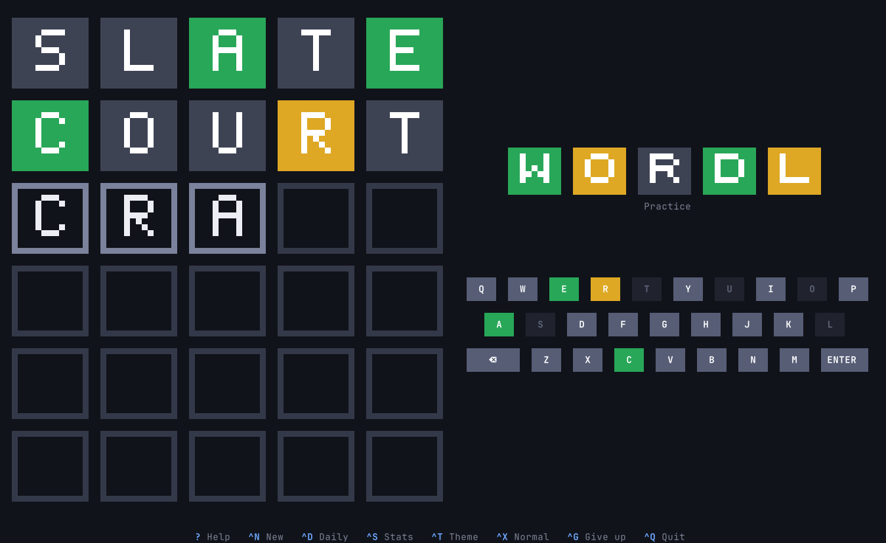
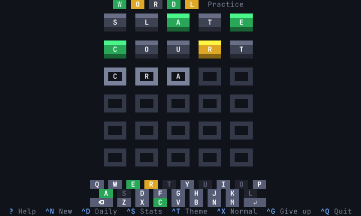

# wordl

A Wordle-style word game for the terminal. Guess the hidden five-letter word in six
tries.



- **Fills the terminal and follows its size.** On a large terminal the tiles and keys
  are big block letters; on a small one they shrink to single characters. Wide
  terminals put the keyboard beside the board, tall ones underneath.
- **Keyboard first, mouse welcome.** Everything has a key; the on-screen keyboard and
  every button can also be clicked.
- **A new word every time**, plus one daily puzzle that is the same for everyone.
- **Three difficulty levels**, five color themes, statistics with streaks, and a
  result you can copy and share.
- **Every word comes with its meaning.** When a game ends, the word is shown with a
  short, plain definition, so a new word is a word learned. The puzzle words are
  chosen to be safe for children.



## Install

wordl runs on macOS and Linux, on Intel and ARM. It is a single program with nothing
else to install; the terminal needs UTF-8, which every current one has.

### Homebrew (macOS and Linux)

```sh
brew install anwarahmed/tap/wordl
```

Update with `brew upgrade wordl`, remove with `brew uninstall wordl`.

### Install script

```sh
curl -fsSL https://raw.githubusercontent.com/anwarahmed/wordl/main/install.sh | sh
```

This downloads the latest release for your machine, checks its checksum, and puts it
in `~/.local/bin` (set `WORDL_BIN_DIR` for somewhere else). A copy installed this way
keeps itself up to date (see [Updates](#updates)). Where there is no prebuilt binary
it builds from source instead, which needs Rust. To remove the game:

```sh
curl -fsSL https://raw.githubusercontent.com/anwarahmed/wordl/main/install.sh | sh -s -- --uninstall
```

If you installed 0.1.x, which was a bash script, run the install script once more: it
replaces the script with the program and removes what the script left behind. Your
statistics carry over.

### Arch Linux

Each [release](https://github.com/anwarahmed/wordl/releases/latest) carries a
`PKGBUILD` for the package `wordl-bin`. Download it into an empty directory and build:

```sh
curl -fsSLO https://github.com/anwarahmed/wordl/releases/latest/download/PKGBUILD
makepkg -si
```

Remove it with `sudo pacman -R wordl-bin`. (The package is not in the AUR yet.)

### From source

Needs Rust 1.88 or newer.

```sh
git clone https://github.com/anwarahmed/wordl
cd wordl
cargo run --release
```

`./install.sh --source` builds and installs in one step; `./install.sh --link` links
`~/.local/bin/wordl` to the checkout's build, for development.

## Updates

| Installed with | How it updates |
| -------------- | -------------- |
| Install script | By itself: when it starts it checks for a newer release, at most once a day, installs it and restarts |
| Homebrew       | `brew upgrade wordl` |
| Arch package   | Build the newer `PKGBUILD` the same way |
| From source    | `git pull`, then build again |

Only the install script's copy updates itself. A copy that Homebrew or pacman owns is
marked as theirs when it is installed and never touches its own file, and neither does
a build run from a checkout.

For a copy that updates itself:

```sh
wordl update        # check now and install a newer release
wordl update off    # stop checking at startup ("on" turns it back on)
```

`WORDL_NO_UPDATE=1` skips the check for one run. The check at startup happens at most
once a day (`wordl update` always checks), waits at most three seconds, and says
nothing when you are offline. An update is verified against the release's
SHA-256 checksum and never moves to an older version; if anything fails, the version
you have starts as usual.

## Play

Type a five-letter word and press Enter. Each tile then tells you how close you were:

| Tile   | Meaning                                |
| ------ | -------------------------------------- |
| Green  | the letter is in the word, in this spot |
| Yellow | the letter is in the word, elsewhere   |
| Gray   | the letter is not in the word          |

The on-screen keyboard keeps track of what you know about each letter.

| Key         | Action                                   |
| ----------- | ---------------------------------------- |
| `A`-`Z`     | type a letter                            |
| `Enter`     | submit the guess                         |
| `Backspace` | delete a letter                          |
| `?` or `F1` | help                                     |
| `Ctrl-N`    | new game with a random word              |
| `Ctrl-D`    | today's daily puzzle                     |
| `Ctrl-S`    | statistics                               |
| `Ctrl-T`    | next color theme                         |
| `Ctrl-X`    | next difficulty                          |
| `Ctrl-G`    | give up and see the word                 |
| `Ctrl-L`    | redraw the screen                        |
| `Ctrl-Q`    | quit                                     |

### Practice and the daily puzzle

Every launch, and every `Ctrl-N`, starts a practice game with a new random word. The
daily puzzle (`Ctrl-D`, or `wordl --daily`) is one word a day, the same for everyone on
the same date; it is the one game that is picked up where you left it. Statistics are
kept separately for the two.

### Difficulty

`Ctrl-X` cycles through three levels. A game that is under way can be made easier at
any time; a harder level applies from the next game.

- **Normal** - guesses must be valid dictionary words.
- **Hard** - Wordle's hard mode: green letters must stay fixed and yellow letters must
  be reused.
- **Ultra Hard** - stricter still: yellow letters must also move away from the spot
  where they were clued, and gray clues must be obeyed (a gray letter can't be played
  again, beyond the copies of it already shown as green or yellow).

A refused guess says which clue it breaks. Shared results mark Hard with `*` and Ultra
Hard with `**`.

### Giving up

When a game is going nowhere, which happens most on Hard and Ultra Hard, `Ctrl-G` ends
it. The game asks first, then shows the word on the board and counts the game as a
loss. From the statistics that follow, Enter starts the next word. A daily puzzle that
was given up stays given up for the day.

### Themes

`midnight` (the default), `daylight`, `neon`, `contrast` and `terminal`. `contrast`
uses orange and blue instead of green and yellow, for color-blind players. `terminal`
uses only your terminal's own 16 colors, so it follows your terminal theme.

### Terminal size

The game redraws itself when the window is resized and picks the largest board that
fits. The smallest usable size is 39 columns by 12 rows (a wide terminal can be as
short as 7 rows). Truecolor is used when the terminal announces it (`COLORTERM`),
256 colors otherwise.

While the game runs it captures the mouse, so selecting text in the terminal needs
Shift (Option in macOS Terminal).

## Options

```
wordl [options]           play
wordl update              check for a newer release now and install it
wordl update off | on     stop, or resume, checking when the game starts
wordl --help | --version | --licenses

  -p, --practice            start with a new random word (default)
  -d, --daily               start with today's puzzle
  -t, --theme NAME          midnight, daylight, neon, contrast or terminal
      --normal              any dictionary word is a valid guess
      --hard                green letters stay fixed, yellow letters must be reused
      --ultra               ultra hard: also, yellow letters must move to another
                            spot and gray letters may not be played again
      --no-animation        skip the tile animations
```

The theme and difficulty you choose in the game are remembered.

## Files

Statistics, the daily puzzle's progress and your settings are plain text files in
`$XDG_STATE_HOME/wordl` (`~/.local/state/wordl` by default). Delete the folder to
start over.

## Word lists

The words come from [SCOWL](http://wordlist.aspell.net/) by Kevin Atkinson, not from
any other game. The lists are built into the program:

- `words/allowed.txt` - about 11,400 five-letter words accepted as guesses.
- `words/answers.txt` - about 1,800 a puzzle can be. The game is meant to be safe for
  children and a way to pick up new words, so the answers are base words, some of them
  hard (`skein`, `tacit`, `abhor`): no plurals, past tenses or comparatives, no names,
  slang, jargon or British-only words, and nothing crude, hurtful, violent or about
  drink, drugs or gambling. All of those are still accepted as guesses.

`tools/build-words.py` regenerates both from a SCOWL download.

`words/definitions.txt` holds a meaning for each of the puzzle words, shown when a
game ends. These were written for this game, with children in mind: one short line
each, giving the sense most worth knowing. They are not from a dictionary, so if one
is wrong or clumsy, an issue or a pull request is welcome.

## Development

```sh
cargo test                                   # rules, word lists, layout at every size, drawing
cargo clippy --all-targets -- -D warnings
cargo build --release && tests/e2e.sh        # the real program in tmux, install.sh, the updater
```

See [CLAUDE.md](CLAUDE.md) for how the code is put together and
[RELEASING.md](RELEASING.md) for how releases are made.

## License

The game, including its definitions, is [MIT licensed](LICENSE). The word lists are
derived from SCOWL and carry
its notice in [`words/SCOWL-COPYRIGHT`](words/SCOWL-COPYRIGHT); `wordl --licenses`
prints both.

wordl is an independent project and is not affiliated with Wordle or The New York
Times.
